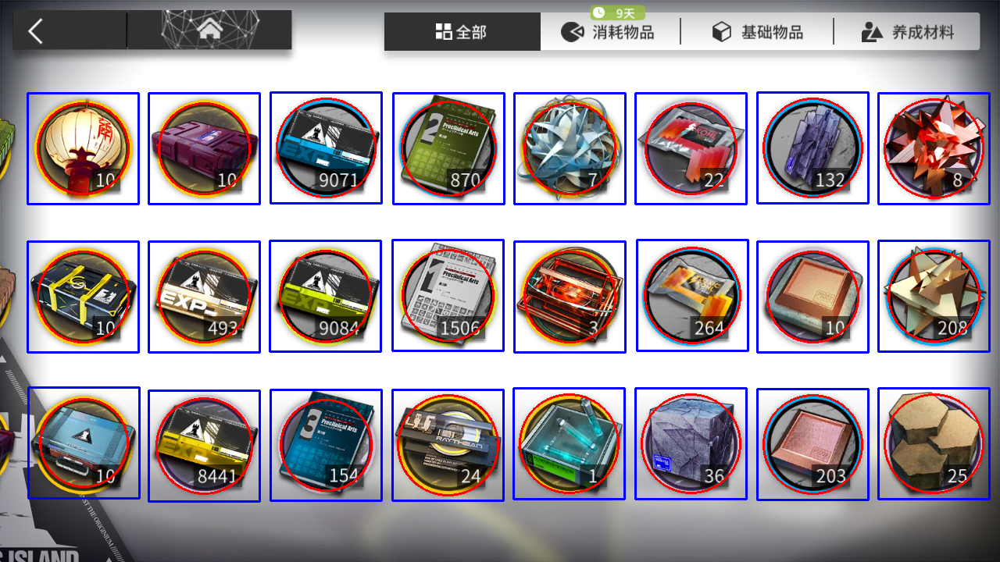

## stage

关卡名称 ocr

使用方法见 [说明](./stage/readme.md)。

### 效果:


```text
{'CB-EX2': (312, 247), 'CB-EX3': (504, 343), 'CB-EX1': (70, 346), 'CB-EX4': (724, 446), 'CB-EX5': (1060, 446)}
```

## inventory

库存物品识别

使用方法见 [说明](./inventory/readme.md)。

### 效果:



```text
name: 研磨石, quantity: 203, pos: (1040, 569), prob: 0.988287627696991
name: 岁过华灯, quantity: 10, pos: (106, 190), prob: 0.9882488250732422
name: 罗德岛物资补给II, quantity: 10, pos: (261, 190), prob: 0.5308178663253784
name: 白马醇, quantity: 22, pos: (884, 190), prob: 0.9976246953010559
name: RMA70-12, quantity: 208, pos: (1195, 379), prob: 0.9975284934043884
name: 32h战略配给, quantity: 10, pos: (106, 380), prob: 0.9944697618484497
name: 三水锰矿, quantity: 36, pos: (884, 568), prob: 0.9808765053749084
name: 轻锰矿, quantity: 132, pos: (1040, 189), prob: 0.9832021594047546
name: RMA70-24, quantity: 8, pos: (1195, 190), prob: 0.9950736165046692
name: 聚合剂, quantity: 1, pos: (728, 568), prob: 0.991705060005188
name: 技巧概要·卷3, quantity: 154, pos: (417, 570), prob: 0.9721420407295227
name: 高级作战记录, quantity: 493, pos: (261, 380), prob: 0.9915186762809753
name: 初级作战记录, quantity: 9071, pos: (417, 189), prob: 0.9958289265632629
name: 中级作战记录, quantity: 8441, pos: (261, 571), prob: 0.9526269435882568
name: 五水研磨石, quantity: 10, pos: (1040, 380), prob: 0.9883330464363098
name: 扭转醇, quantity: 264, pos: (886, 378), prob: 0.9905290007591248
name: 感谢庆典物资补给, quantity: 10, pos: (107, 567), prob: 0.957239031791687
name: 提纯源岩, quantity: 25, pos: (1195, 568), prob: 0.9808457493782043
name: 双极纳米片, quantity: 3, pos: (729, 380), prob: 0.997378945350647
name: 技巧概要·卷1, quantity: 1506, pos: (573, 378), prob: 0.9665932059288025
name: 其它, quantity: 24, pos: (573, 570), prob: 0.9196686744689941
name: 基础作战记录, quantity: 9084, pos: (416, 379), prob: 0.984555184841156
name: D32钢, quantity: 7, pos: (729, 190), prob: 0.988500714302063
name: 技巧概要·卷2, quantity: 870, pos: (574, 190), prob: 0.9858826398849487
```

## 配置环境

```shell
# 训练
python3 -m venv env
source env/bin/activate
pip install -r requirements.txt

# 使用时可以直接用 opencv 的 dnn 模块进行推理
pip install opencv-python, numpy
```
